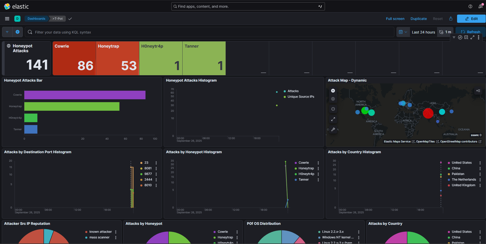

#  T-Pot Honeypot Deployment on Azure VM

## 📌 Project Overview

This project demonstrates the deployment and configuration of **[T-Pot Honeypot](https://github.com/telekom-security/tpotce)** on an **Azure Cloud Virtual Machine**.

T-Pot is a **multi-honeypot platform** integrating several honeypot technologies (e.g., Cowrie, Dionaea, Elastihoney, etc.) into a single environment. It provides researchers, defenders, and cybersecurity learners with real-world attack data and insights.

By deploying it on **Azure Cloud Infrastructure**, this project focuses on:

* 📊 Collecting live attack telemetry
* 🕵️‍♂️ Understanding attacker TTPs (Tactics, Techniques, Procedures)
* ⚡ Building hands-on skills in **Threat Intelligence & Honeypot Management**
* ☁️ Leveraging cloud scalability to host and monitor honeypots effectively

## 🚀 Features of the Deployment

* ✅ **T-Pot Community Edition (latest release)** installation on Ubuntu Server
* ✅ **Azure Cloud VM** configuration (networking, security groups, firewall rules)
* ✅ Centralized **ELK Stack Dashboard** for visualization
* ✅ Integrated honeypot services: Cowrie, Dionaea, Conpot, ADBHoney, etc.
* ✅ Secure remote access and monitoring setup
* ✅ Documentation of installation steps, troubleshooting, and dashboards

## 📖 Documentation & Guide

For a **step-by-step guide, screenshots, and detailed documentation**, check out my blog post:
👉 [Setting up a T-Pot Honeypot on Azure VM (Complete Guide)](https://medium.com/@amanthakur9889/setting-up-a-t-pot-honeypot-on-azure-vm-complete-guide-cf5b867ba6a8)

## 🛠️ Tech Stack

* **Cloud Provider**: Microsoft Azure
* **OS**: Ubuntu Server (LTS)
* **Honeypot Framework**: T-Pot CE
* **Visualization**: ELK Stack (Elasticsearch, Logstash, Kibana)
* **Security Tools**: Azure NSGs, SSH Hardening

## 📊 Sample Dashboard (T-pot)

## 🎯 Learning Outcomes

* Hands-on with **honeypot deployment and management**
* Understanding **threat intelligence gathering**
* Deploying cybersecurity tools on **cloud infrastructure**
* Documenting technical projects for professional visibility

## 🤝 Connect with Me

If you find this project useful or want to collaborate on security projects, let’s connect:

* 🔗 [Medium Blog](https://medium.com/@amanthakur9889)
* 💼 [LinkedIn](https://www.linkedin.com/in/cyberamanx/)
* 🐦 [Twitter/X](https://x.com/cyberwithaman)

⭐ **Feel free to fork, raise issues, or share ideas to improve this project.**
